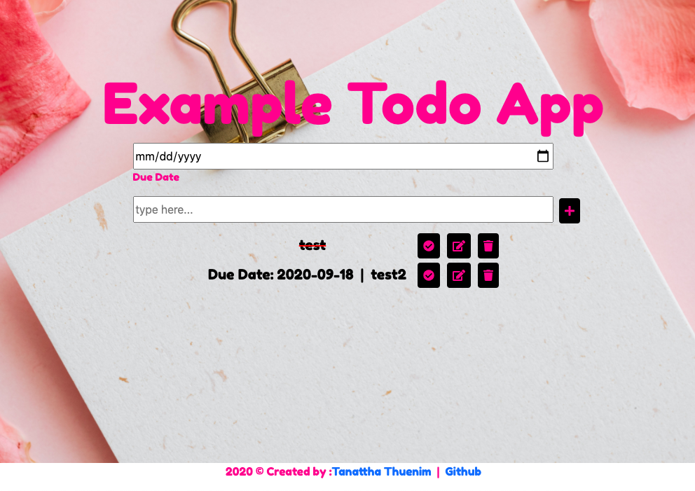

# Example-Todo-App

This app was built with React and designed by HTML, CSS and bootstrapped. This's a sample Todo app that allows you to create your list with a due date, edit, delete and mark as completed feature.

## Live App

[CLICK HERE](https://example-todo-app.herokuapp.com/)

## Installation

Fork and clone repos

    $ git clone https://github.com/Tanattha/Example-Todo-App.git

Using two terminals, switch to each respective directory

    $ cd example-todo-aoo

Install the packages

    $ npm install

Startup the server for frontend

    $ npm start

## License

The gem is available as open source under the terms of the [MIT License](https://opensource.org/licenses/MIT).

## Special Thanks

https://www.pexels.com/ 
https://favicon.io/ 
[Font: Fredoka One](https://fonts.google.com/specimen/Fredoka+One)

and everything else from google!
